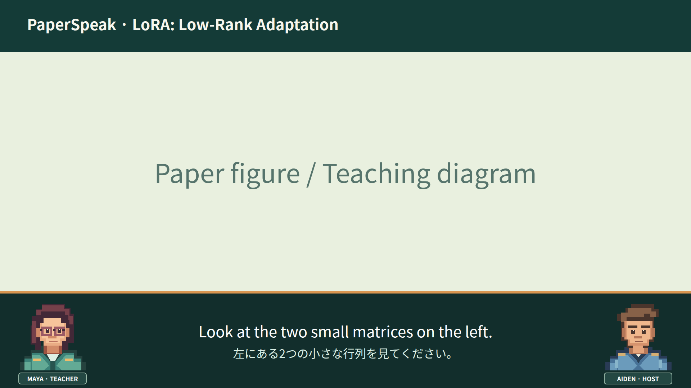
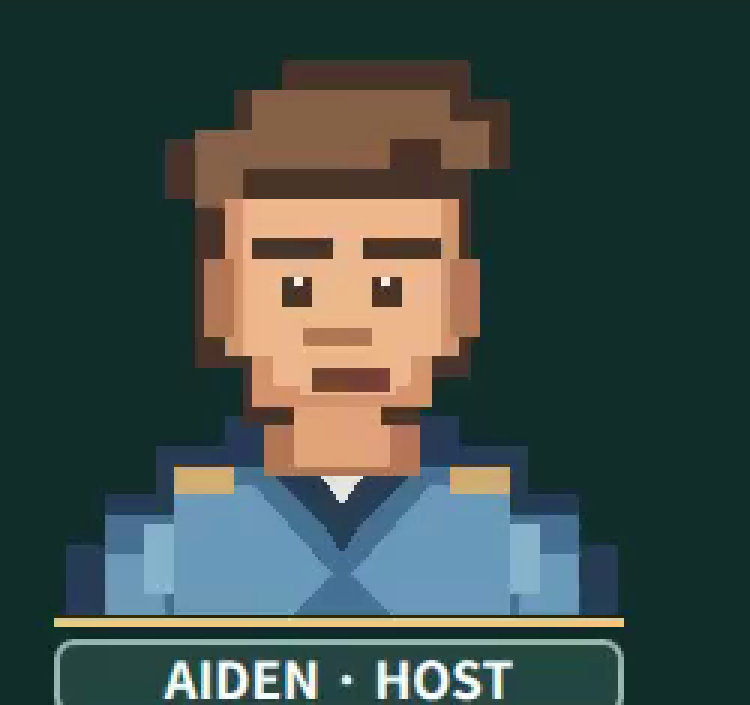
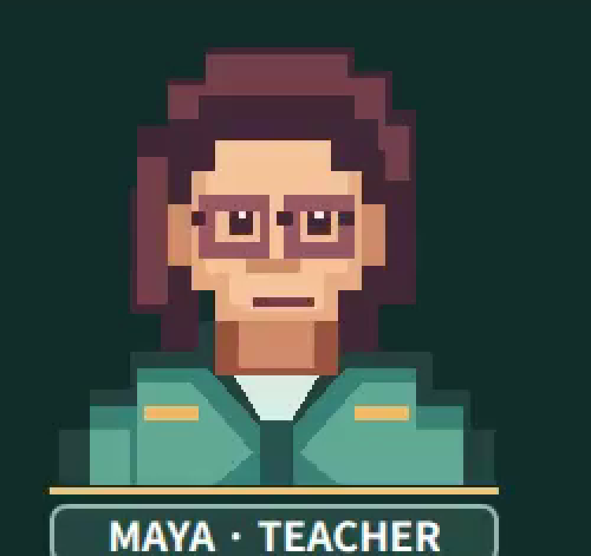
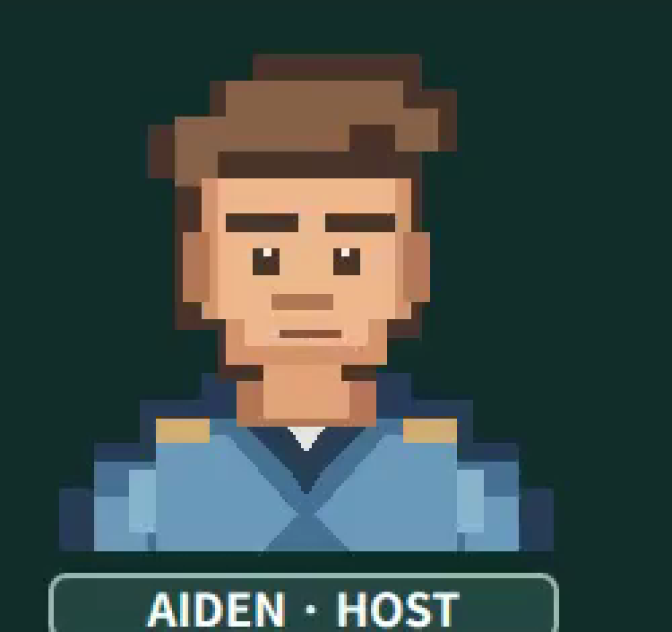
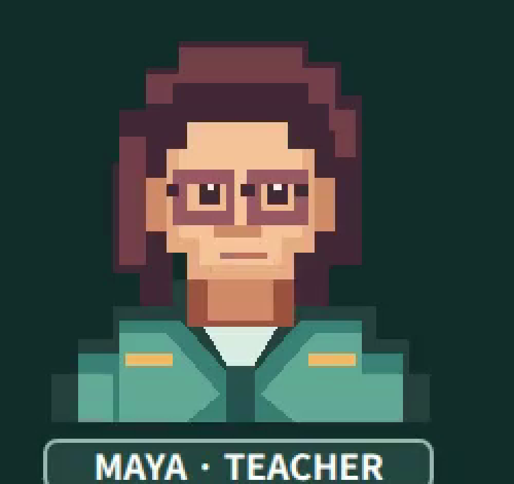

# 動画キャラクターの確認結果（2026-09-27）

左のMayaが先生、右のAidenが聞き手です。上の画像は配置のプレビューです。キャラは `assets/video/` のオリジナルSVGで、既存ゲームの画像は使っていません。

## 口の位置

動画形式 `visual-video-5` では、下部欄の枠線7pxがアニメーション座標から抜けていました。静止画の口は動画上のy=952〜954pxにあり、アニメーションの開いた口は7px上から描かれていました。`visual-video-6` では枠線を座標に含め、開いた口の上辺を静止画の口と同じy=952pxに合わせました。まばたきの座標も同様に修正しました。静止画の口ピクセルを実際に描画し、アニメーションの座標と比較する回帰試験を追加しました。

| Aiden | Maya |
| --- | --- |
|  |  |
|  |  |

## 文と文の間

話者が変わる場合も同じ話者が続けて話す場合も、文と文の間に1秒の無音を入れます。無音中は直前の図を表示し、字幕を消し、二人とも口を閉じます。第2章で同じ話者の文間を実動画から確認し、中央0.4秒の音声RMSは0.0、次の発話は2184.4でした。字幕も無音区間に表示されません。

## 新版MP4

LoRAの完成済み第1・2章を `visual-video-6` として再出力しました。旧版MP4は保持しています。既存の教材WAVと検証済み題名WAVを再利用し、題名WAVのSHA-256が旧版と一致することを確認しました。

| 確認項目 | 結果 |
| --- | --- |
| 第1章 | 629.12秒、34.31 MiB。旧版 `visual-video-5` は560.12秒 |
| 第2章 | 454.48秒、23.98 MiB。旧版 `visual-video-5` は431.48秒 |
| 形式 | H.264 High、1920×1080、30 fps、yuv420p、AAC-LC 48 kHz ステレオ |
| 英日字幕 | 第2章の英語149文字・日本語76文字の文で、両言語とも省略・はみ出し・キャラとの重なりなし |
| 図の切替 | 第1章の補助図から論文原図1への切替を実フレームで確認 |
| オフライン | ネットワーク名前空間を切断し、保存済みLoRAの図・WAV・字幕から13.84秒のMP4を生成 |
| LANダウンロード | `https://192.168.10.112:8443` 経由でMP4の範囲取得を確認 |
| 回帰試験 | `pytest -q`: 138 passed |

全章MP4は、この教材の全41章が検証済みで、同じ動画形式の章MP4がすべて完成したときだけ結合されます。現時点で新版の完成章は第1・2章です。
